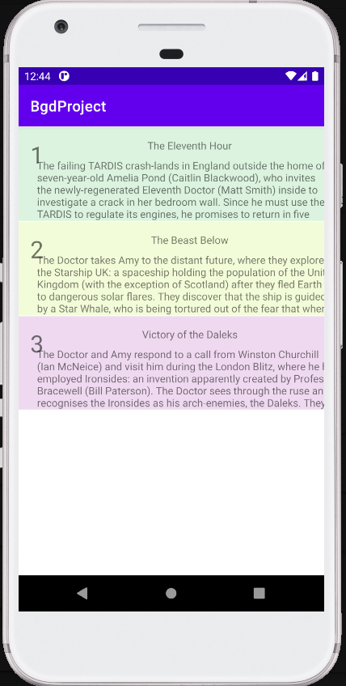

# BgdProject
Android, MongoDB, Kotlin.

Application showing mongo db integration with kotlin in android app.

<h3>User can:</h3>

- login with saved username and password,
- create new username with password if user with submitted username doesn't exists,
- browse tv series seasons,
- browse tv series season episodes,
- borwse tv series season episode comments by other users,
- add new comment to tv series episode,
- delete comment if its currents user comment.

<h3>Environment preparation:</h3>

Before running application mongo db server must be installed on the same machine which is running android studio.
Mongo db server should use connection string: mongodb://10.0.2.2:27017
In mongo db base of name bgd must be created. Inside it there will be a collection, named shows, which will contain tv series data and user comments.
Initial tv series info and user comments can be imported from file import.js with command:
```javascript
mongo bgd import.js
```

<h3>Used technologies:</h3>

- kotlin,
- finding views from layout with view binding,
- mongodb for storing tv shows info and user commenst,
- snappydb for key value db for storing users login names and passwords,
- AsyncTask,
- AlertDialog,
- RecyclerView

<h3>App screenshots:</h3>

Login screen         |  Tv shows screen
:-------------------------:|:-------------------------:
  |   
<br>

Tv show episodes screen        |  Episode commenst screen
:-------------------------:|:-------------------------:
  |   
<br>

<h3>App during usage:</h3>

Logging in        |  Adding a comment
:-------------------------:|:-------------------------:
  |   
<br>
